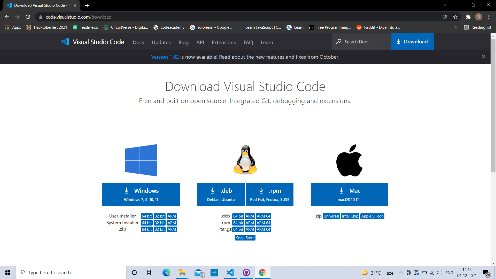
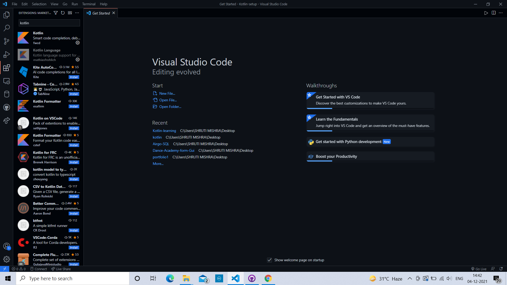
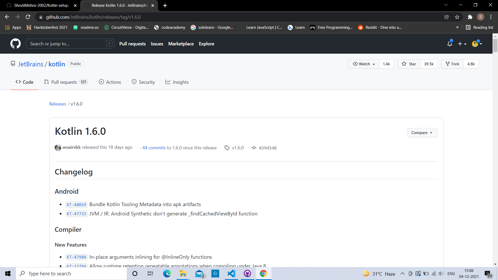
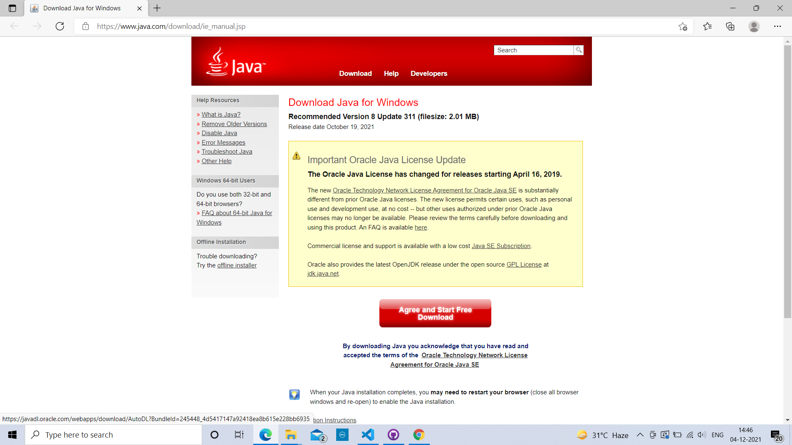

# Kotlin Setup
 

   
<h2> What setup do you need for Kotlin to work on your VScode? :hammer_and_wrench:	 </h2>
  

<h3>Install VScode::woman_technologist:	</h3>
  
<a href ="https://code.visualstudio.com/download">DOWNLOAD FROM HERE</a>
  

  

<h2>Extension for kotlin::mag_right:</h2>
  

Just type kotlin in your extension search box 	

  

  

<h2> Download Kotlin Compiler For VScode::computer: </h2>
  
<a href ="https://github.com/JetBrains/kotlin/releases/download/v1.5.32/kotlin-compiler-1.5.32.zip">DOWNLOAD ZIP FILE FROM HERE</a>
  

  

<h2>Install Java::page_facing_up:	</h2>
  
<a href ="https://www.java.com/download/ie_manual.jsp">DOWNLOAD FROM HERE</a>
  

  
<h2> And finally you are done :star_struck::heavy_check_mark:</h2>
   
<h2>📌 Contact :</h2>
  

<a href="mailto:shrutidmishra2002@gmail.com">

 

© 2021 Shruti Mishra 
